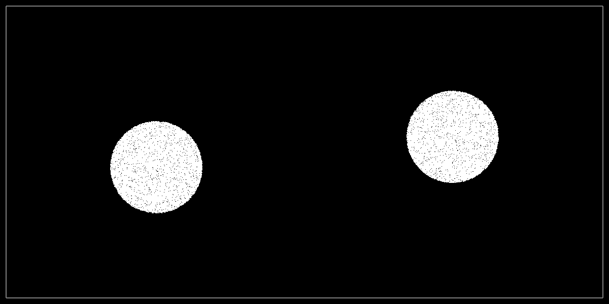

# Material Point Method for Snow Simulation
A 2D pipeline for rendering physically accurate snow dynamics based on the "Material Point Method for Snow Simulation" (Stomakhin et al., 2013).



### Build
The following commands can be used to build the soluation, and generate the executable:
``` bash
mkdir build
cd build
cmake .. -G "Visual Studio 17 2022" -A x64 -DCMAKE_BUILD_TYPE=Release
cmake --build . --target MPM_solver --config Release
```

### Simulation
All of the simulation parameters are located in `src/Parameters.h`. The frames of the simulation will be rendered into the `render/` folder.

